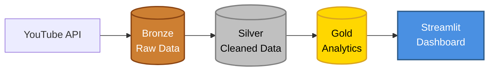

<div align="center">

# STREAMWATCH

### IDS 706 Fall 2025 Final Project

 

**Team 6 (Streamsmiths): Tony Ngari, Can He, Matthew Fischer, Joseph Hong, Trey Chase**

</div>

## Table of Contents

- [Project Overview](#Project-Overview)
- [Architecture](#Architecture)
- [Setup](#Setup)
- [Dashboard](#Dashboard)
- [Database](#Database)
- [Key Principles](#Key-Principles)
- [Future Improvements](#Future-Improvements)

---

# Project Overview

**STREAMWATCH** is a comprehensive YouTube analytics platform that provides insights into channel performance, video trends, and milestone tracking.

The platform processes data from 50+ YouTube channels through a **bronze-silver-gold data pipeline architecture**, delivering:
- Real-time channel and video performance tracking
- Milestone achievement monitoring
- Engagement analytics and trend identification
- Historical data analysis with interactive visualizations

### Team

| Name | Role | Responsibilities |
|------|------|-----------------|
| **Tony N.** | Leader / Engineering | Architecture, database design, integrations, project coordination |
| **Joseph H.** | Engineering | Data processing workflows, API integration, model development |
| **Trey C.** | Data Science | Model development, metrics calculation |
| **Can H.** | Analytics | Dashboard development, visualization design |
| **Matthew F.** | Data Science | Model development, metrics calculation |

---

# Architecture

STREAMWATCH implements a **medallion architecture** (bronze-silver-gold).

**Data Source**
[**YouTube Data API v3**](https://developers.google.com/youtube/v3)

**Bronze Layer**

- Grabs raw data from YouTube (channel info, videos, trending content) and saves as JSON files with timestamps

**Silver Layer**

- Cleans up the raw data, Calculates useful metrics like engagement rates, milestons, then converts JSON to Parquet (a faster file format)

**Gold Layer**

- Takes cleaned data and loads it into the database

**Orchestration**

- Runs all three layers in order automatically
- Can be scheduled to run hourly via GitHub Actions

**Visualization**

- Interactive web dashboard displaying channnel and video metrircs.


   
---

# Setup

**Get a YouTube API Key:**
1. Go to [Google Cloud Console](https://console.cloud.google.com/)
2. Create a new project
3. Enable "YouTube Data API v3"
4. Create credentials (API key)
5. Copy the API key to `.env`

**Set up Neon Database:**
1. Sign up at [Neon.tech](https://neon.tech)
2. Create a new project
3. Copy the connection string to `NEON_DATABASE_URL`
   
### 1. Clone the Repository
```bash
git clone https://github.com/ngnk/streamsmiths.git
cd streamsmiths
```

### 2. Install Dependencies
```bash
pip install -r requirements.txt
```

### 3. Configure Environment Variables
Create a `.env` file in the project root:

```bash
# YouTube API Configuration
YOUTUBE_API_KEY=YOUR_YOUTUBE_API_KEY

# Database Configuration
NEON_DATABASE_URL=YOUR_DATABASE_CONNECTION_STRING

# Channel List (comma-separated channel IDs)
YOUTUBE_CHANNEL_IDS=UCupvZG-5ko_eiXAupbDfxWw,UCX6OQ3DkcsbYNE6H8uQQuVA
```

### 4. Confirm all componenets are good-to-go
```bash
python test_setup.py
```

### 5. Initialize Database Tables
Run the pipeline setup script to create tables:

```bash
python scripts/setup_database.py
```

### 6. Run Initial Data Ingestion
```bash
python pipeline/ingest_youtube_data.py
```

### 7. Launch Dashboard
```bash
cd dashboard
streamlit run dashboard.py
```

Access the dashboard at `http://localhost:8501`

### 8. (Optional) Set Up GitHub Actions
For automated pipeline runs:

1. Fork the repository
2. Go to **Settings → Secrets and variables → Actions**
3. Add secrets:
   - `YOUTUBE_API_KEY`
   - `NEON_DATABASE_URL`
   - `YOUTUBE_CHANNEL_IDS`
4. Enable GitHub Actions in repository settings and activate `workflow_v3`
5. Pipeline will run automatically every hour

---

# Dashboard

- The dashboard with key metrics on channels, videos, and engagement, alongside leaderboards for top creators and recent uploads.
- Users can explore channels through a graded leaderboard system and drill down into any creator to view their full video catalog.
- The Video Explorer highlights viral content, major milestones, and trending videos with filters and badge indicators.
- A Milestone Tracker provides forecasting, progress bars, and velocity metrics for videos nearing major view thresholds.
- Each video has a deep-dive page with 30-day history, growth analytics, engagement ratios, and full metadata.


---

# Database

Each pipeline iteration (baseline, V2, and V3) maintains separate tables to preserve historical data while allowing for system improvements.

The tables contain the following information:

- **channels_log_v3**: Channel metadata including subscriber counts, total views, video counts, thumbnails, country, keywords, and topic categories
- **videos_log_v3**: Video performance metrics with engagement rates, milestone tracking, and attention segmentation (billionaires_watch, milestones_watch, highly_viral)
- **trending_videos_log_v3**: Trending videos by region with all the same metrics as videos_log_v3 plus trending_region
- **Earlier versions** (baseline, V2): Historical pipeline versions for comparison and analysis

You may query the tables as desired. For instance, if you'd like to see the latest channel statistics:

```sql
SELECT channel_title, subscriber_count, view_count, video_count
FROM channels_log_v3
ORDER BY ingestion_timestamp DESC
LIMIT 10;
```

To streamline analytics, consider creating database views. 

For example, you can define a view to always retrieve the latest data for every channel:

```sql
CREATE VIEW latest_channels_view AS
SELECT DISTINCT ON (channel_id)
    channel_id,
    channel_title,
    custom_url,
    subscriber_count,
    view_count,
    video_count,
    country,
    published_at,
    thumbnail_url,
    keywords,
    topic_categories,
    ingestion_timestamp
FROM channels_log_v3
ORDER BY channel_id, ingestion_timestamp DESC;
```

To develop additional metrics, you could deploy this query against the `videos_log_v3` table to view the hourly change in views and comments.

```sql
WITH video_snapshots AS (
    SELECT 
        video_id,
        video_title,
        channel_title,
        view_count,
        like_count,
        comment_count,
        ingestion_timestamp::timestamp as snapshot_time,
        LAG(view_count) OVER (PARTITION BY video_id ORDER BY ingestion_timestamp::timestamp) as prev_view_count,
        LAG(like_count) OVER (PARTITION BY video_id ORDER BY ingestion_timestamp::timestamp) as prev_like_count,
        LAG(comment_count) OVER (PARTITION BY video_id ORDER BY ingestion_timestamp::timestamp) as prev_comment_count,
        LAG(ingestion_timestamp::timestamp) OVER (PARTITION BY video_id ORDER BY ingestion_timestamp::timestamp) as prev_snapshot_time
    FROM videos_log_v3
)
SELECT 
    video_id,
    video_title,
    channel_title,
    view_count,
    like_count,
    comment_count,
    snapshot_time,
    prev_snapshot_time,
    EXTRACT(EPOCH FROM (snapshot_time - prev_snapshot_time)) / 3600 as hours_between_snapshots,
    view_count - COALESCE(prev_view_count, 0) as view_count_change,
    like_count - COALESCE(prev_like_count, 0) as like_count_change,
    comment_count - COALESCE(prev_comment_count, 0) as comment_count_change,
    ROUND((view_count - COALESCE(prev_view_count, 0))::numeric / 
          NULLIF(EXTRACT(EPOCH FROM (snapshot_time - prev_snapshot_time)) / 3600, 0), 2) as views_per_hour
FROM video_snapshots
WHERE prev_snapshot_time IS NOT NULL
    AND snapshot_time >= NOW() - INTERVAL '24 hours'
ORDER BY views_per_hour DESC
LIMIT 50;
```

Overall, numerous options exist for database manipulation. These examples serve as a starting point.

---

# Key Principles

### 1. Scalability
- **Horizontal Scaling**: Database-driven channel management supports 50-100+ channels (vs. 25-channel GitHub Secrets limit)
- **API Quota Efficiency**: Pipeline consumes only 77 units/run (35x under estimated 2,719), providing massive headroom
- **Time-Series Architecture**: Append-only Bronze tables support unlimited historical growth
- **Cloud Database**: Neon PostgreSQL with connection pooling handles concurrent queries

### 2. Modularity
- **Versioned Tables**: Separate V1, V2, V3 schemas preserve existing data during iteration
- **Layered Architecture**: Bronze (raw) → Silver (transformed) → Gold (analytics) separation
- **Reusable Functions**: `calculate_grade()`, `format_number()`, `load_channels()` used across dashboard
- **Independent Workflows**: Separate GitHub Actions for V1, V2, V3 pipelines

### 3. Reusability
- **Templated SQL Queries**: Parameterized queries work for channels, videos, time ranges
- **Abstracted Data Loaders**: `load_video_history()`, `load_channel_history()` functions
- **Style Components**: Reusable CSS classes (`.metric-card`, `.channel-card`, `.milestone-badge`)
- **Visualization Templates**: Plotly chart configurations used across multiple pages

### 4. Observability
- **Ingestion Timestamps**: Every record tagged with `ingestion_timestamp` for lineage tracking
- **Pipeline Logging**: GitHub Actions logs capture API responses, row counts, errors
- **Version Tracking**: V1 → V2 → V3 tables preserve evolution history
- **Dashboard Metrics**: Real-time counts of channels, videos, Billionaires Club members

### 5. Data Governance
- **Schema Versioning**: V1, V2, V3 tables document pipeline evolution
- **Immutable Bronze Layer**: Raw API responses never modified (append-only)
- **Data Lineage**: Clear transformation path: Bronze → Silver → Gold
- **Quality Validation**: Timestamp formatting, duplicate detection, null handling

### 6. Reliability
- **Connection Pooling**: SQLAlchemy `pool_pre_ping=True` prevents stale connections
- **Error Recovery**: Try-catch blocks in API calls with graceful degradation
- **Scheduled Automation**: GitHub Actions hourly cron ensures consistent data freshness
- **Caching Strategy**: Streamlit `@st.cache_data(ttl=3600)` reduces database load

### 7. Efficiency
- **API Quota Optimization**: Batch requests, selective field retrieval (`part='snippet,statistics'`)
- **Query Optimization**: `DISTINCT ON` for latest records, indexed `ingestion_timestamp`
- **Dashboard Caching**: 1-hour TTL prevents redundant database queries
- **Selective Data Loading**: Only fetch 20 videos per page, 30-day history windows

### 8. Security
- **Secret Management**: API keys stored in GitHub Secrets, never committed to Git
- **Environment Variables**: `.env` file in `.gitignore`, `python-dotenv` for local dev
- **Database Encryption**: Neon provides SSL/TLS connections by default
- **No Hardcoded Credentials**: All sensitive data externalized to environment config

---

## Future Improvements

This project is currently in an early stage, and we've identified several areas that will take the idea to the next level. Our primary focus for future development is organized into the following categories:

**User Experience and Interface (UI/UX)**
- Migrate the frontend from Streamlit to a more robust framework like Next.js. This will provide greater customization and control over the visualization experience, enabling a more professional and scalable user interface.
- Implement features for custom channel/video watchlists and easier input methods. This will facilitate more efficient control over the data being tracked and analyzed.
- Explore browser extensions or tools for seamless integration and data input directly from video platforms.
  

**Data Sourcing**
- Integrate data from platforms like the Twitter API and Spotify to analyze social engagement surrounding video content.
- Incorporate data from Google Trends and Wikipedia to provide richer context and external factors influencing the trends being analyzed.
- Implement predictive modeling or alternative strategies to counteract YouTube API subscriber count rounding.
  

**Data Orchestration and Scalability**
- Consider additional workflow tools, such as Apache Airflow. This will allow for greater resilience, more complex and high-level data transformations, and improved monitoring for a scalable, production environment.

---

<div align="center">
    <strong>Built with ❤️ by the STREAMSMITHS</strong><br>
    <em>IDS 706 Fall 2025 - Duke University</em>
</div>
